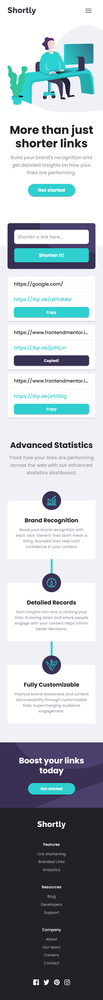

# Shortly (URL shortening)

This is a solution to the [Shortly URL shortening API Challenge challenge on Frontend Mentor](https://www.frontendmentor.io/challenges/url-shortening-api-landing-page-2ce3ob-G).

## Table of contents

- [Overview](#overview)
  - [The challenge](#the-challenge)
  - [Screenshots](#screenshots)
  - [Links](#links)
- [Built with](#built-with)
- [Author](#author)
## Overview

### The challenge

Users are able to:

- View the optimal layout for the site depending on their device's screen size
- Shorten any valid URL
- See a list of their shortened links, even after refreshing the browser
- Log in to save their shortened links (with: github, discord)
- Copy the shortened link to their clipboard in a single click.
- Delete a shortened URL from their list
- Receive an error message when the `form` is submitted if:
  - The `input` field is empty
  - The URL is not valide
  - The URL is already in the list

### Screenshots
#### Desktop

#### Mobile

### Links

- [Solution URL](https://www.frontendmentor.io/profile/Dyios)
- [Live Site URL](https://url-shortening-dyios.vercel.app/)

## Built with

- Semantic HTML5 markup
- Mobile-first workflow
- [React](https://reactjs.org/) - JS library
- [Next.js](https://nextjs.org/) - React framework
- [emotion](https://emotion.sh/docs/introduction) - For styles
- [MUI](https://mui.com/) - Components library
## Author

- Website - [TOLBA Rafik](https://r-tolba.netlify.app/)
- Frontend Mentor - [@Dyios](https://www.frontendmentor.io/profile/Dyios)